# Internal Developer Platform - Backstage & ArgoCD

## Prerequisites (Google Cloud)

1. Go to Google Cloud Console.
2. Activate cloud shell.
3. Create terraform bucket

    ```bash
    gcloud storage buckets create gs://$GOOGLE_CLOUD_PROJECT-idp-terraform
    ```

4. Enable APIs in Google Cloud.

    ```bash
    gcloud services enable compute.googleapis.com
    gcloud services enable iam.googleapis.com
    gcloud services enable container.googleapis.com
    gcloud services enable cloudresourcemanager.googleapis.com
    ```

## Prerequisites (GitHub)

1. Create a new GitHub organization with the same name of the $GOOGLE_CLOUD_PROJECT variable to avoid conflicts with your personal account or other organizations you may have.

  <p style="text-align: center;" markdown="1">
  [Create GitHub Organization](https://github.com/account/organizations/new?plan=free){ .md-button .md-button--primary }
  </p>

  ??? example "Example - Create GitHub Organization"
      

2. Enable Public packages in GitHub organization.

    ```bash
    echo "https://github.com/organizations/$GOOGLE_CLOUD_PROJECT/settings/packages"
    ```

  ??? example "Example - Enable Public Packages"
      

3. Login to GitHub.

    ```bash
    gh auth login -s admin:org
    ```

  ??? example "Example - GitHub Login"
      

4. Configure git to use your GitHub username and email.

    ```bash
    git config --global user.email "ada@example.com"
    git config --global user.name "Ada Lovelace"
    ```

5. Create team named `platform` GitHub.

    ```bash
    gh api -X POST /orgs/$GOOGLE_CLOUD_PROJECT/teams -f name="platform" -f description="Platform team" -f privacy="closed"
    ```

6. Create and clone main repositories.

    ```bash
    mkdir ~/repos
    cd ~/repos
    gh repo create $GOOGLE_CLOUD_PROJECT/infra-as-code-gc --template="ohmyplatform/infra-as-code-gc-template" --private --clone
    gh repo create $GOOGLE_CLOUD_PROJECT/argocd-apps --template="ohmyplatform/argocd-apps-template" --private --clone
    ```

7. Replace values for GitHub Organization and Google Project Identifier

    ```bash
    find ./ -type f -exec sed -i "s/\${{\__GITHUB_ORG__\}}/$GOOGLE_CLOUD_PROJECT/g" {} +
    find ./ -type f -exec sed -i "s/\${{\__GOOGLE_PROJECT_ID__\}}/$GOOGLE_CLOUD_PROJECT/g" {} +
    ```

8. Push changes to GitHub.

    ```bash
    git -C ~/repos/infra-as-code-gc/ add .
    git -C ~/repos/infra-as-code-gc/ commit -m "chore: replace values"
    git -C ~/repos/infra-as-code-gc/ push
    git -C ~/repos/argocd-apps/ add .
    git -C ~/repos/argocd-apps/ commit -m "chore: replace values"
    git -C ~/repos/argocd-apps/ push
    ```

9. Click over button `Open Editor` and open folder `repos`.

## Task 1. Create GKE infrastructure

1. Create `terraform_secrets.tfvars` file in `infra-as-code-gc/gke` folder:

    ```bash
    echo 'email = "me@ohmyplatform.com"' >> ~/repos/infra-as-code-gc/gke/terraform_secrets.tfvars
    ```

2. Apply terraform from `gke` folder

    ```bash
    cd ~/repos/infra-as-code-gc
    terraform -chdir=./gke init
    terraform -chdir=./gke plan --var-file=terraform.tfvars --var-file=terraform_secrets.tfvars -out gke.plan
    terraform -chdir=./gke apply gke.plan
    ```

3. Connect to GKE cluster created in previous step:

    ```bash
    gcloud container clusters get-credentials idp --region europe-west1 --project $GOOGLE_CLOUD_PROJECT
    ```

4. Check if you can connect to the cluster:

    ```bash
    kubectl get nodes
    ```

5. Get Load-Balancer IP.

    ```bash
    gcloud compute forwarding-rules list --format json | jq -r '.[] | .IPAddress'
    ```

6. Configure DNS in GoDaddy.
   - Go to Backstage Software Template [Create GoDaddy Subdomain](https://backstage.ohmyplatform.com/create/templates/default/godaddy-subdomain) and fill the required fields with the following information:
     - **GitHub Organization Name**: Your GitHub organization name created previously
     - **IP Address**: The value obtained in the previous step.

## Task 2. Deploy ArgoCD

### Step 1. Register an OAuth application for ArgoCD

1. ArgoCD allows you to use local users or SSO (Single Sign-On). In this workshop we will use GitHub as the OIDC provider. To do so, we need to register an OAuth application in GitHub. You can copy the result link to configure it:

    ```bash
    echo "https://github.com/organizations/$GOOGLE_CLOUD_PROJECT/settings/applications/new"
    ```

2. Use the following values:
   - Application name:

      ```bash
      argocd
      ```

   - Homepage URL:

      ```bash
      echo "https://argocd.$GOOGLE_CLOUD_PROJECT.ohmyplatform.com"
      ```

   - Authorization callback URL:

      ```bash
      echo "https://argocd.$GOOGLE_CLOUD_PROJECT.ohmyplatform.com/api/dex/callback"
      ```

3. Generate Client secret.

  ??? example "Example - ArgoCD OAuth App"

      

### Step 2. Create ArgoCD Infrastructure

1. Create `terraform_secrets.tfvars` file in `infra-as-code-gc/argocd`.

    ```bash
    touch ~/repos/infra-as-code-gc/argocd/terraform_secrets.tfvars
    ```

2. Copy Client ID and Client secret and put it in the previously created `terraform_secrets.tfvars` file with these values:

    ```bash
    argocd_sso_client_id = "<argocd_github_client_id>"
    argocd_sso_client_secret = "<argocd_github_client_secret>"
    ```

3. Apply terraform from `argocd` directory

    ```bash
    cd ~/repos/infra-as-code-gc
    terraform -chdir=./argocd init
    terraform -chdir=./argocd plan --var-file=terraform.tfvars --var-file=terraform_secrets.tfvars -out argocd.plan
    terraform -chdir=./argocd apply argocd.plan
    ```

4. Go to ArgoCD login URL, that will be `https://argocd.<your_org_name>.ohmyplatform.com` where a login screen like the following should be displayed.

    

5. Click in buttom **LOG IN VIA GITHUB** to access ArgoCD using GitHub team `platform` created previously

## Task 3. Deploy Backstage

### Step 1. Register an OAuth application for Backstage

1. In the same way than ArgoCD, we need to register an OAuth application in GitHub for Backstage. You can copy the result link to configure it:

    ```bash
    echo "https://github.com/organizations/$GOOGLE_CLOUD_PROJECT/settings/applications/new"
    ```

2. It will be used the following values for the configuration:

   - Application name:

      ```bash
      backstage
      ```

   - Homepage URL:

      ```bash
      echo "https://backstage.$GOOGLE_CLOUD_PROJECT.ohmyplatform.com"
      ```

   - Authorization callback URL:

      ```bash
      echo "https://backstage.$GOOGLE_CLOUD_PROJECT.ohmyplatform.com/api/auth/github/handler/frame"
      ```

3. Generate Client secret.
4. Copy and save Client ID and Client secret. You will need them in the [Step 3. Deploy Backstage with terraform](#step-3-deploy-backstage-with-terraform).

### Step 2. Create Backstage GitHub App

1. Follow the result link to start configuring it:

    ```bash
    echo "https://github.com/organizations/$GOOGLE_CLOUD_PROJECT/settings/apps/new"
    ```

2. Use the following values and click on `Create GitHub App`:

  !!! warning
      The GitHub App Name shouldn't be no longer than 34 characters, that is the reason why in the commands used below the name is generated from `$GOOGLE_CLOUD_PROJECT` using `cut` command.

   - GitHub App name:

      ```bash
      echo Backstage-$GOOGLE_CLOUD_PROJECT | cut -c1-34
      ```

   - Homepage URL:

      ```bash
      echo "https://backstage.$GOOGLE_CLOUD_PROJECT.ohmyplatform.com"
      ```

   - Click on `Active` checkbox in `Webhook` section to disable it.

   - Permissions:
     - Repository:
       - **Administration**: `Read and write`
       - **Commit statuses**: `Read-only`
       - **Contents**: `Read and write`
       - **Issues**: `Read and write`
       - **Metadata**: `Read-only`
       - **Pull requests**: `Read and write`
       - **Workflows**: `Read and write`
     - Organization:
       - **Members**: `Read-only`

3. Generate Client secret.
4. Generate a private key.
5. Install Backstage GitHub App in all repositories.
6. Copy and save GitHub App credentials. You will need in the step 3:

   - App ID
   - Client ID
   - Client Secret
   - Private key

### Step 3. Deploy Backstage with terraform

1. Create and clone Backstage and software-templates repositories.

    ```bash
    cd ~/repos
    gh repo create $GOOGLE_CLOUD_PROJECT/backstage --template="ohmyplatform/backstage-template" --public --clone
    gh repo create $GOOGLE_CLOUD_PROJECT/software-templates --template="ohmyplatform/software-templates-template" --public --clone
    ```

2. Replace values for GitHub Organization and Google Project Identifier

    ```bash
    find ~/repos/ -type f -exec sed -i "s/\${{\__GITHUB_ORG__\}}/$GOOGLE_CLOUD_PROJECT/g" {} +
    find ~/repos/ -type f -exec sed -i "s/\${{\__GOOGLE_PROJECT_ID__\}}/$GOOGLE_CLOUD_PROJECT/g" {} +
    ```

3. Push changes to GitHub.

    ```bash
    git -C ~/repos/backstage/ add .
    git -C ~/repos/backstage/ commit -m "chore: replace values"
    git -C ~/repos/backstage/ push
    git -C ~/repos/software-templates/ add .
    git -C ~/repos/software-templates/ commit -m "chore: replace values"
    git -C ~/repos/software-templates/ push
    ```

4. Create `terraform_secrets.tfvars` file in `infra-as-code-gc/backstage` folder:

    ```bash
    touch ~/repos/infra-as-code-gc/backstage/terraform_secrets.tfvars
    ```

5. Use the values obtained in the previous steps and put it in the previously created `terraform_secrets.tfvars` file with these values:

    ```bash
    backstage_auth_github_client_id = ""
    backstage_auth_github_client_secret = ""
    backstage_integration_github_app_id = ""
    backstage_integration_github_client_id = ""
    backstage_integration_github_client_secret =""
    backstage_integration_github_private_key =<<EOF

    EOF

    # The empty line after EOF is required
    ```

6. Apply terraform code from `backstage` folder

    ```bash
    cd ~/repos/infra-as-code-gc
    terraform -chdir=./backstage init
    terraform -chdir=./backstage plan --var-file=terraform.tfvars --var-file=terraform_secrets.tfvars -out backstage.plan
    terraform -chdir=./backstage apply backstage.plan
    ```

7. Add Backstage application to ArgoCD Apps

    ```bash
    cd ~/repos/argocd-apps
    cat <<EOF > apps/backstage.yaml
    apiVersion: argoproj.io/v1alpha1
    kind: Application
    metadata:
      name: backstage
      namespace: argocd
      finalizers:
      - resources-finalizer.argocd.argoproj.io
    spec:
      destination:
        namespace: backstage
        server: 'https://kubernetes.default.svc'
      project: default
      source:
        repoURL: git@github.com:$GOOGLE_CLOUD_PROJECT/argocd-apps.git
        targetRevision: main
        path: configuration/backstage
      syncPolicy:
        automated:
          prune: true
          selfHeal: true
        syncOptions:
        - CreateNamespace=true
      ignoreDifferences:
      - group: apps
        kind: Deployment
        jsonPointers:
        - /spec/replicas
    EOF
    ```

8. Commit and push changes to GitHub

    ```bash
    git -C ~/repos/argocd-apps/ add .
    git -C ~/repos/argocd-apps/ commit -m "feat: add backstage application"
    git -C ~/repos/argocd-apps/ push
    ```

9. Go to ArgoCD to check if Backstage application has been deployed successfully.

10. Go to your Backstage URL and check everything is working as expected 🚀.

## Task 4. Create an application with Backstage

1. Go to Software Templates.

    ```bash
    echo "https://backstage.$GOOGLE_CLOUD_PROJECT.ohmyplatform.com/create"
    ```

2. There should be one template called `.NET API` like in the following image.

    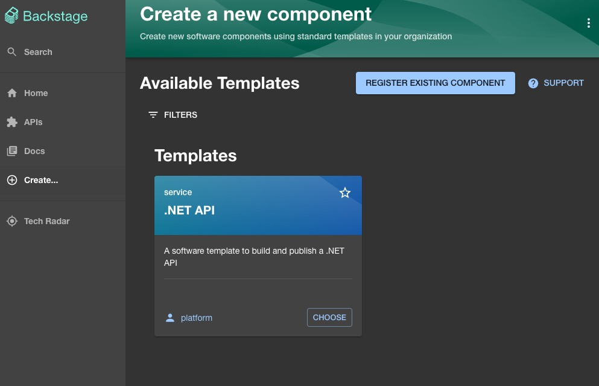

3. Choose `.NET API` template.

4. Fill the required values **with the same name** like in screenshots showed below.

    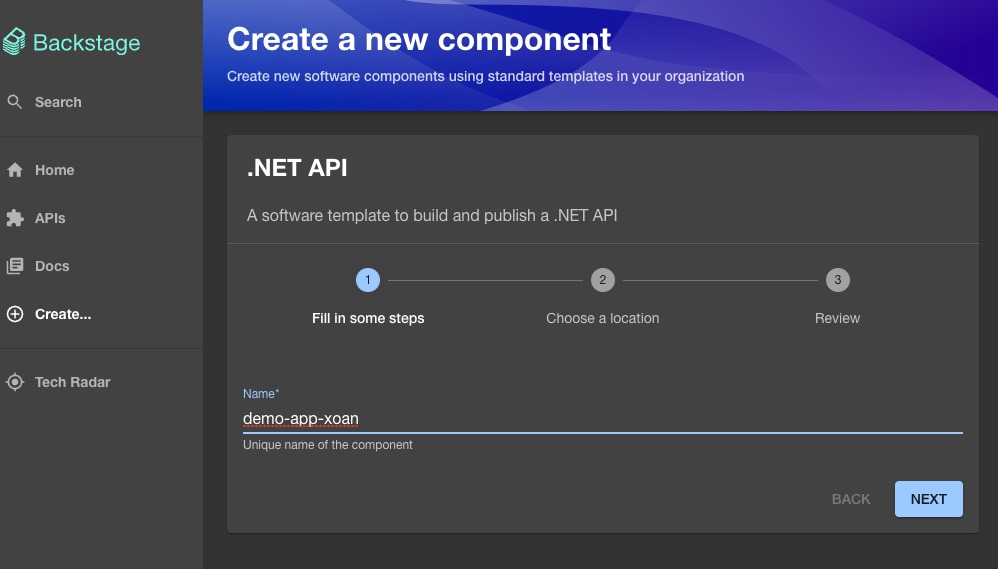
    *Filling name of component*

    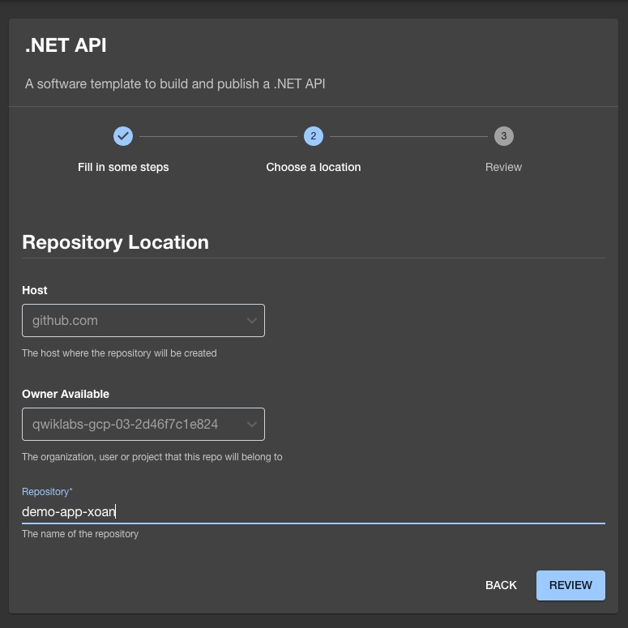
    *Filling repository name*

5. Finally, a summary of the data entered will be displayed. Once it has been verified that the data entered is correct, click on the `CREATE` button.

    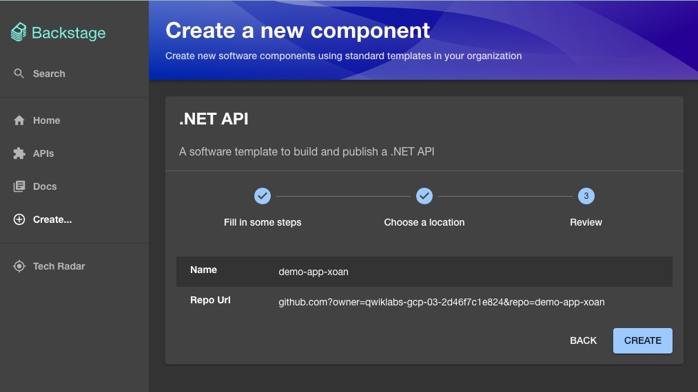
    *Summary data introduced for component to create*

6. The template execution will be launched, where the following will be performed:

   1. Creation of the repository
   2. Register the application in the Backstage catalog
   3. Pull Request creation in the `argocd-apps` repository with the necessary values to create the ArgoCD Application and the Kubernetes manifests for it

7. After the execution is performed it will be showed a Summary

    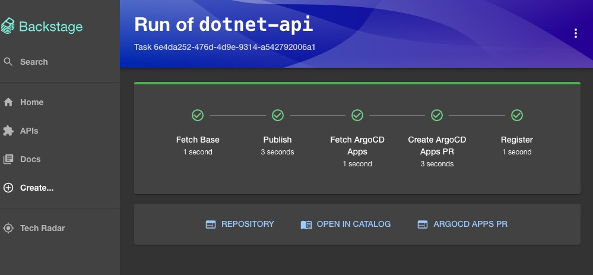
    *.NET API software template summary of execution*

8. The buttons shown in the summary exposed in the previous image will allow to access the different actions performed by the execution of the software template

   1. By clicking on the `REPOSITORY` button the created repository can be accessed

      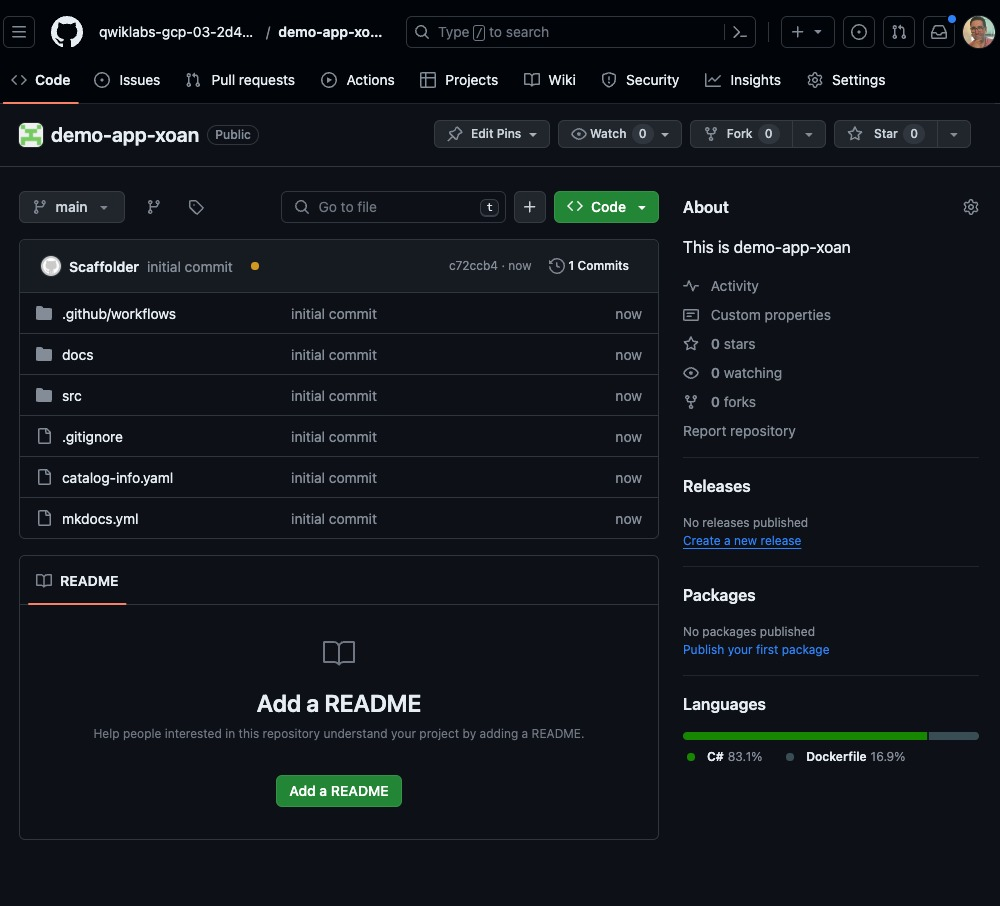
      *Repository created*

   2. By clicking on the `OPEN IN THE CATALOG` button the created component in the catalog can be accesed

      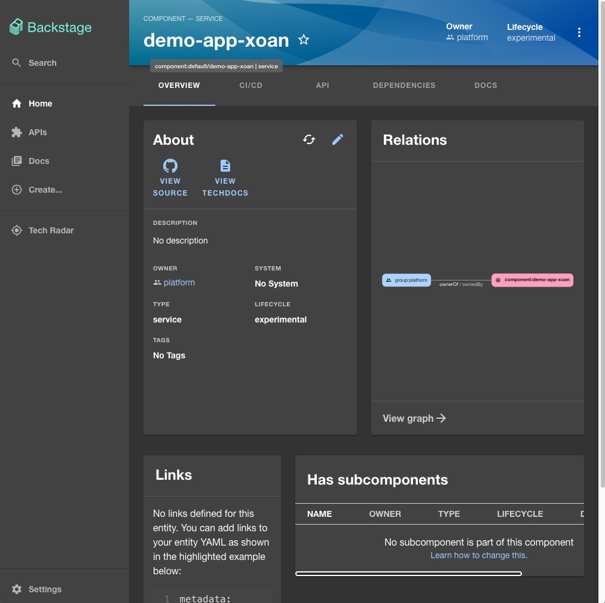
      *Component registered in catalog overview*
  
   3. By clicking on the `ARGOCD APPS PR` the created Pull Request in repository `argocd-apps` can be accesed.

      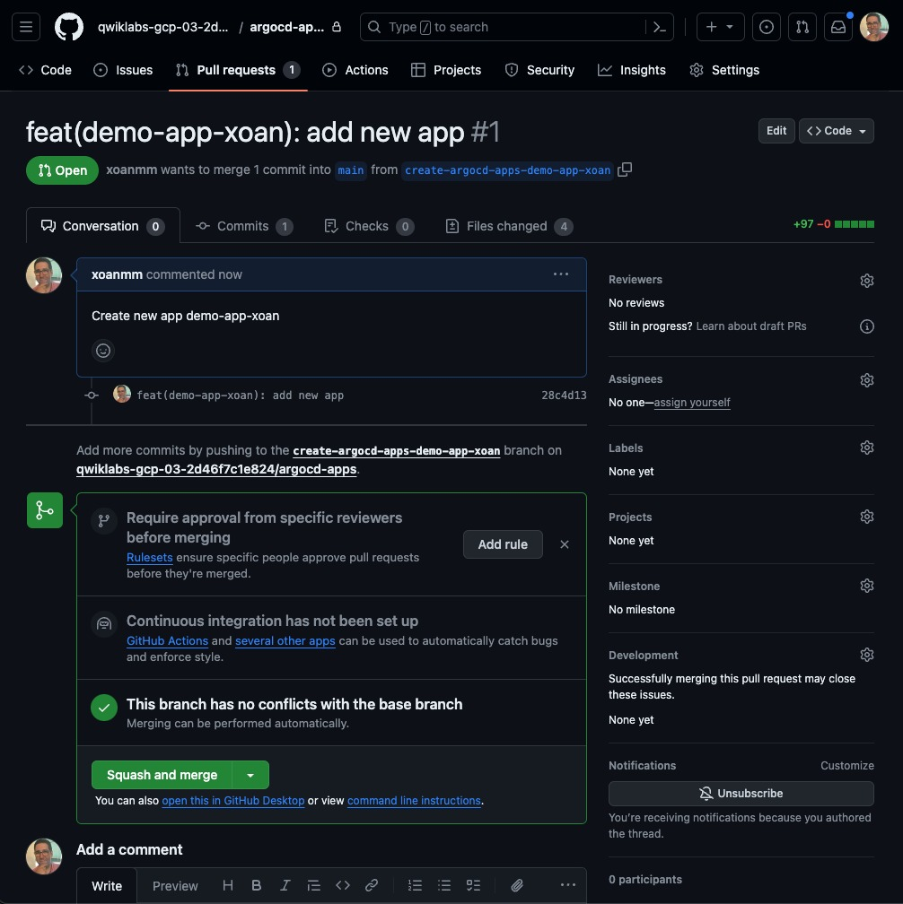
      *argocd-apps Pull Request created*

      It's necessary to click on button `Squash and Merge` for Merge the Pull Request.

9. The argocd-apps application in ArgoCD should be accessed through the specific URL:

    ```bash
    echo "https://argocd.$GOOGLE_CLOUD_PROJECT.ohmyplatform.com/applications/argocd/argocd-apps?view=tree&resource="
    ```

10. Accesing the URL obtained from the previous step it will be seen that the only Application is `backstage`.

    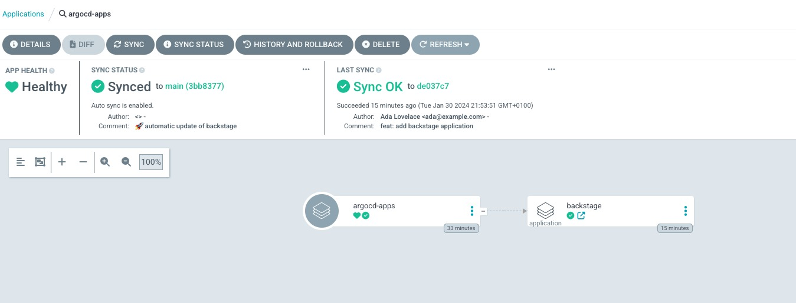

11. Clicking in button `REFRESH` it should appear a new `Application` called with the name filled in the `.NET API` template in the initial steps

    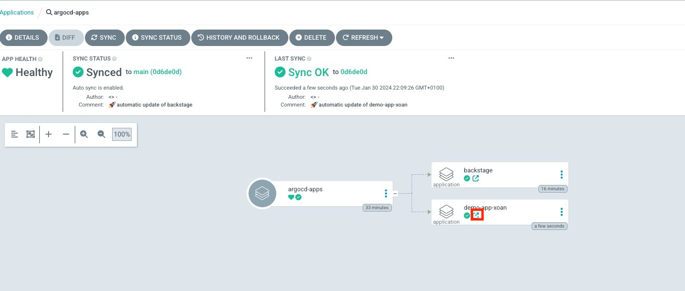

12. Clicking on the button to access directly to the application, indicated in the previous image by a red square, will take you to the application details, where you should see something like the one shown below.

    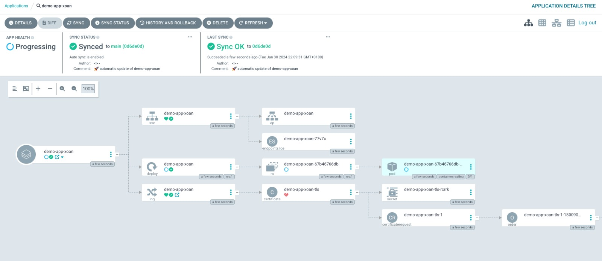

    !!! info
        In an initial state an error will be displayed, because the certificate is being requested with cert-manager and is not ready yet.

13. After a few minutes the cerficate will be ready and should appear all the elements with successfully creation status like in the following image.

    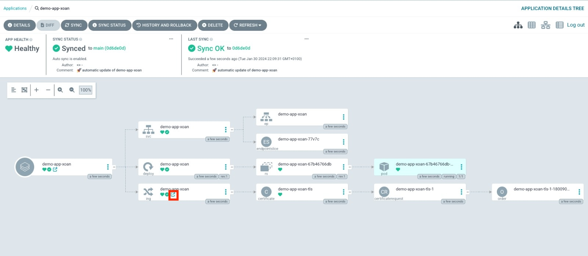

14. By clicking on the Ingress shortcut, using the icon marked with a red square in the image above, you will be able to access the application created, it will be necessary to add `/swagger/index.html` to the URL where you will be redirected.

  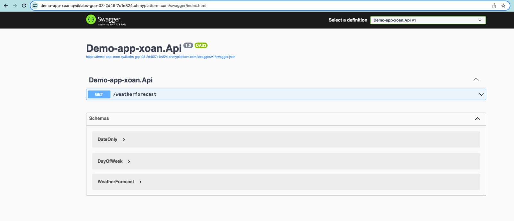